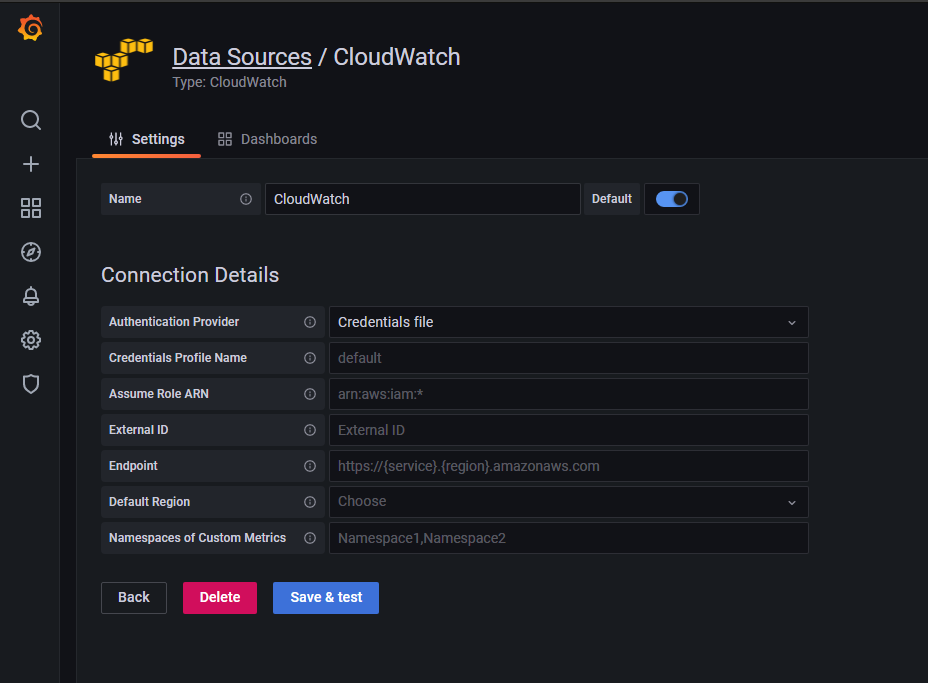
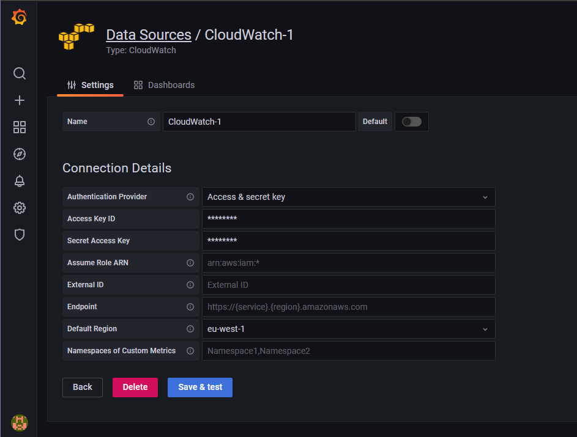

# Introduction to Grafana
## Install Grafana on an EC2
1. On AWS, initialise an EC2 with the AMI-ID > "ami-0943382e114f188e8"
2. SSH into the instance
3. Execute the following commands to install Grafana on the EC2 instance
    ```bash
    sudo apt-get update -y
    sudo apt-get upgrade -y
    sudo apt-get install -y adduser libfontconfig1
    wget https://dl.grafana.com/enterprise/release/grafana-enterprise_8.1.5_amd64.deb
    sudo dpkg -i grafana-enterprise_8.1.5_amd64.deb
    sudo nano /etc/apt/sources.list
    curl https://packagecloud.io/gpg.key | sudo apt-key add -
    sudo wget https://s3-us-west-2.amazonaws.com/grafana-releases/release/grafana_5.2.4_amd64.deb
    sudo apt-get install grafana
    sudo systemctl daemon-reload
    sudo systemctl start grafana-server
    sudo systemctl status grafana-server
    sudo systemctl enable grafana-server.service
    sudo service grafana-server start
    systemctl status grafana-server.service
    ```
    - In `/etc/apt/sources.list`, add this line at the end of the file >> `https://packagecloud.io/grafana/stable/debian/ stretch main`
      
4. Execute the following commands to configure Grafana:
    ```bash
    sudo update-rc.d grafana-server defaults
    sudo systemctl enable grafana-server.service
    sudo nano /usr/share/grafana/.aws/credentials
    sudo chmod 0644 /usr/share/grafana/.aws/credentials
    ```
    - The format of the `/usr/share/grafana/.aws/credentials` is:
      ```bash
      [default]
      aws_access_key_id = ***************
      aws_secret_access_key = ***************
      region = eu-west-1
      ```

## Accessing Grafana
### Logging in
To access Grafana, go to the public IP address of the EC2 instance with Grafana installed and add `:3000` to end of the address > `[IP-EC2]:3000`

You will be shown a login page where the login details are:

  Username: Admin
  Password: Admin
  
After logging in, assign your own password.

### Adding a data source [Credentials file]
On the "Welcome to Grafana page", there should be a box/widget titled "Add your first data source". If this can't be seen, go to the sidebar on the left and hover over the settings/cog icon. The first option in the menu is "Data sources".
Next, click "Add data source". A list of data sources will be shown. Either find the data source you want to use, or use the filter at the top of the page.
Select your chosen data source *(Cloudwatch)*, and the new page will look like this:



The settings for the following options should be as follows **(ALL OTHER OPTIONS SHOULD BE LEFT BLANK OR AS DEFAULT)**
  - Authentication Provider > Credentials file
  - Default Region > eu-west-1


### Adding a datasource [Using AWS keys]
On the "Welcome to Grafana page", there should be a box/widget titled "Add your first data source". If this can't be seen, go to the sidebar on the left and hover over the settings/cog icon. The first option in the menu is "Data sources".
Next, click "Add data source". A list of data sources will be shown. Either find the data source you want to use, or use the filter at the top of the page.
Select your chosen data source *(Cloudwatch)*.



Input your AWS keys into the relevant sections and set your region.

### Adding a dashboard
On the sidebar, hover over the addition symbol and select "Dashboard".

